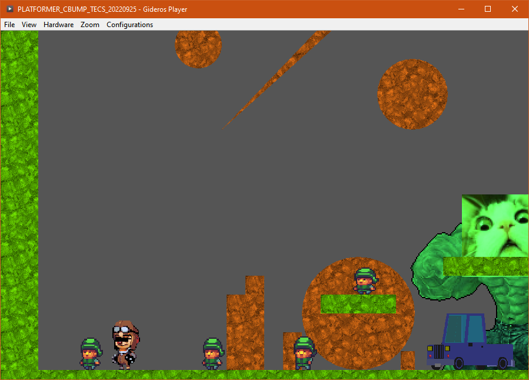

# GIDEROS PLATFORMER STARTER KIT USING CBUMP, GCAM, TILED AND TINY ECS

The aim of this repo is to lay down the first bricks of a platformer using ECS in Gideros Studio **http://giderosmobile.com**.

I commented the code to explain my understanding of ECS. I hope you will learn something from this project and as an exercise I left the bullet implementation for you to do 🩹

This project is for me a way to learn ECS in Gideros. I wanted to try the ECS architecture pattern because my platformer, which uses the OOP approach, was turning into spaghetti code. Let's see if ECS solves the problem ;-)

**Note**: this work is largely inspired by @MultiPain's tiny-ecs project (https://github.com/MultiPain/Gideros-tiny-ECS). **Rrraptor** you are a great source of inspiration, thank you for all you do for Gideros 🥇.
